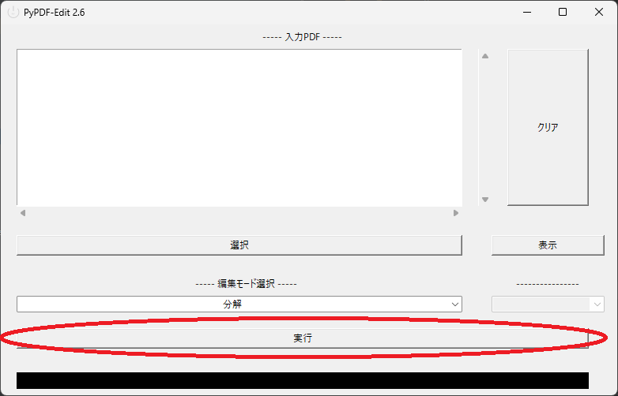

# Py PDF Edit

tkinter + PyPDF2 + pdf2image (+ poppler)で
GUIでPDFのページごとに分解、複数のPDFを結合、回転、画像に変換を行える

## 使い方
### 1. インストール

[リリースページから最新版](https://github.com/HsaSheep/py-pdf-edit/releases/latest/)をダウンロードし、インストールしてください。
※v3.0.0以前のバージョンはそれぞれ別のアプリケーションとしてインストールされますので、更新の場合はアンインストール後にインストールしてください。
※.zipを解凍して利用している場合、基本的に解凍したファイルを上書きで問題ありません。上書き後、挙動がおかしい場合は削除、コピーでお試しください。

画像変換を使用する場合、インストール後に
インストール先フォルダ内にpopplerフォルダを作成し、
[Poppler for Windows](https://blog.alivate.com.au/poppler-windows/)からpoppler-X.XX.X_x86.7zをダウンロード、解凍し得られる
フォルダ、ファイルをそのまま入れてください。

例(v2.7から)：

Tree \PATH\TO\PY-PDF-EDIT\INSTALL\DIR 
├─lib 
│　　└─… 
├─poppler 
│　　├─bin 
│　　├─include 
│　　├─lib 
│　　└─share 
├─PyPDF-Edit.exe 
└─…

※2.6までは「PyPDF-Edit.exe」が「tkinter_main.exe」となります。

### 2. 実行

Ver2.6まで： インストール先ディレクトリのtkinter_main.exeを実行してください。

Ver2.7から： インストール先ディレクトリのPyPDF-Edit.exeを実行してください。

### 3.ファイルの追加

ファイルを追加するには選択ボタンをクリックします。
表示された選択ダイアログでPDFファイルを選択してください。
ドラッグ＆ドロップで追加することもできます。

選択したファイルは順に「—-入力PDF—-」の下の欄に追加されます。

ファイルを選択しなおす時は、クリアボタンをクリックしてください。

なお、複数ファイルを同時にD&Dするとファイル名でソートされます。
特に後述する結合モードは入力ファイルの並び順の通りに結合しますので、注意してください。

### 4. モード選択

モードはドロップダウンから選択します。

・分解…複数ページのPDFを分解し、(ファイル名)_(ページ番号).pdfのように1ページずつ出力します。

・結合…入力PDFに登録された複数のPDFを1つのPDFとして出力します。

・回転…入力PDFに登録されたPDFを選択した角度まで時計回りに回転し、保存します。

・画像変換…入力PDFに登録されたPDFを選択した形式、DPIで保存します。※Popplerの導入が必要です。

・暗号化…入力PDFにパスワードを設定、または変更します。パスワード設定(暗号化)を空欄にすると解除します。

### 5. 実行

ファイル選択、モード選択、（モードによってはオプションの選択、)まで完了したら
実行ボタンをクリックすると、保存先を指定するダイアログが表示されます。
保存先、単一のファイルを書き出すモードの場合はファイル名を決定すると出力を開始します。

完了後は保存先をエクスプローラで表示します。
また、下の黒い部分に「完了」と表示されます。

## Q&A

### 1. 処理開始から完了にならない

エラーが発生し、フリーズしている可能性があります。
応答がない、または5分程度待機したが完了しない場合、終了し最初からやり直すか、多ページのPDFの場合は分解する等負荷を軽減して再度試してください。

### 2. 選択したあと、「—-入力PDF—-」のパスがおかしい
（部分的に#uXXXXXX[Xは英数字]や〜¥¥〜などになっている)

日本語やその他の文字列が影響、またはOSの仕様等による不具合の可能性があります。
可能であればクリアボタン下の表示ボタンをクリックし、表示されたウィンドウをスクリーンショット、
また、本来のファイルパスをメモ帳や送信時の本文にバージョンと合わせて記載し、送ってください。

### 3. うまくいかない、完了にならない

念の為、ファイル名やフォルダ名を英数字かつスペースなし(C:¥¥test¥test1.pdfなど)に変更し、
再度選択、実行してください。
また、画像変換の場合はPopplerのバージョンを確認してください。
基本的に作成時のパッケージ等のバージョンはリポジトリ内のvalues.pyにメモしてあります。
そのバージョンでうまくいかず、より新しいバージョンが出ている場合は新しいバージョンで試してください。
